# K6 Observability Stack

Un stack completo de observabilidad para pruebas de carga usando K6, InfluxDB y Grafana.

## Arquitectura del Sistema

### Diagrama General de la Arquitectura


### Flujo de Datos

```mermaid
sequenceDiagram
    participant K6 as K6 Load Generator
    participant TARGET as Target Application
    participant INFLUX as InfluxDB
    participant GRAFANA as Grafana
    
    Note over K6,GRAFANA: Inicio de la prueba de carga
    
    K6->>TARGET: HTTP Request
    TARGET->>K6: HTTP Response
    
    Note over K6: Procesamiento de métricas
    K6->>INFLUX: Envía métricas en tiempo real
    Note over INFLUX: Almacenamiento de series temporales
    
    loop Durante toda la prueba
        K6->>TARGET: Múltiples requests
        TARGET->>K6: Responses
        K6->>INFLUX: Métricas continuas
    end
    
    Note over GRAFANA: Visualización en tiempo real
    GRAFANA->>INFLUX: Consulta métricas
    INFLUX->>GRAFANA: Datos de métricas
    GRAFANA->>GRAFANA: Actualiza dashboards
    
    Note over K6,GRAFANA: Fin de la prueba
```



### Interacción de Componentes


## Descripción

Esta aplicación proporciona una solución completa para realizar pruebas de carga y monitorear el rendimiento en tiempo real. La stack incluye:

- **K6**: Generador de carga que ejecuta pruebas de rendimiento
- **InfluxDB**: Base de datos de series temporales para almacenar métricas
- **Grafana**: Dashboard para visualizar métricas en tiempo real

## Componentes

### K6 (Load Generator)
- **Puerto**: 8081
- **Configuración**: 5 usuarios virtuales durante 60 segundos
- **Target**: https://test.k6.io
- **Funcionalidad**: Ejecuta pruebas de carga y envía métricas a InfluxDB

### InfluxDB (Time Series Database)
- **Puerto**: 8086
- **Base de datos**: k6
- **Funcionalidad**: Almacena métricas de rendimiento en tiempo real

### Grafana (Dashboard)
- **Puerto**: 3000
- **Funcionalidad**: Visualización de métricas y dashboards en tiempo real
- **Credenciales**: Configuradas mediante variables de entorno

## Prerrequisitos

- Docker
- Docker Compose
- Variables de entorno configuradas

## Configuración

### 1. Variables de Entorno

Crea un archivo `.env` en la raíz del proyecto:

```bash
# Grafana Configuration
GF_SECURITY_ADMIN_USER=admin
GF_SECURITY_ADMIN_PASSWORD=admin123

# InfluxDB Configuration
INFLUXDB_DB=k6
INFLUXDB_USER=admin
INFLUXDB_PASSWORD=admin123
```

### 2. Estructura del Proyecto

```
k6-observability-stack/
├── load-test/
│   └── k6/
│       ├── docker-compose.yaml
│       └── test/
│           └── test.js
├── monitoring/
│   ├── docker-compose.yaml
│   └── grafana-provisioning/
│       ├── dashboards/
│       │   ├── k6-load-test.json
│       │   ├── k6-simple-dashboard.json
│       │   └── k6-vus-test.json
│       ├── dashboards.yaml
│       └── datasources/
│           └── datasources.yaml
├── .env.example
└── README.md
```

## Instalación y Uso

### 1. Clonar el repositorio

```bash
git clone <repository-url>
cd k6-observability-stack
```

### 2. Configurar variables de entorno

```bash
cp .env.example .env
# Editar .env con tus credenciales
```

### 3. Crear la red de Docker

```bash
docker network create monitoring-net
```

### 4. Ejecutar el stack de monitoreo

```bash
cd monitoring
docker-compose up -d
```

### 5. Ejecutar las pruebas de carga

```bash
cd ../load-test/k6
docker-compose up
```

### 6. Acceder a los servicios

- **Grafana Dashboard**: http://localhost:3000
  - Usuario: admin
  - Contraseña: admin (o la configurada en .env)

- **InfluxDB**: http://localhost:8086
  - Base de datos: k6

## Configuración de Grafana

### 1. Configurar fuente de datos InfluxDB

La fuente de datos InfluxDB se configura automáticamente mediante el archivo `datasources.yaml`:

```yaml
datasources:
  - name: InfluxDB
    type: influxdb
    access: proxy
    isDefault: true
    url: http://influxdb:8086
    database: k6
    user: admin
    password: admin
```

### 2. Dashboards Automáticos

Los dashboards se importan automáticamente desde la carpeta `dashboards/`:

- **k6-load-test.json**: Dashboard completo para pruebas de carga
- **k6-simple-dashboard.json**: Dashboard simplificado
- **k6-vus-test.json**: Dashboard enfocado en usuarios virtuales

## Ejecutar Pruebas de Carga

### Modificar el script de prueba

Edita `load-test/k6/test/test.js` para personalizar tus pruebas:

```javascript
import http from 'k6/http';
import { check, sleep } from 'k6';
import { Rate } from 'k6/metrics';

// Custom metric
const errorRate = new Rate('errors');

export let options = {
  stages: [
    { duration: '30s', target: 5 }, 
    { duration: '1m', target: 10 },  
    { duration: '30s', target: 0 },  
  ],
  thresholds: {
    http_req_duration: ['p(95)<500'], 
    http_req_failed: ['rate<0.1'],   
  },
};

export default function () {
  const urls = [
    'https://test.k6.io',
    'https://httpbin.org/delay/1',
    'https://httpbin.org/status/200',
    'https://httpbin.org/status/404',
  ];
  
  const url = urls[Math.floor(Math.random() * urls.length)];
  
  const res = http.get(url);
  
  sleep(Math.random() * 2 + 0.5);
  
  check(res, {
    'status is 200': (r) => r.status === 200,
    'response time < 500ms': (r) => r.timings.duration < 500,
  });
  
  errorRate.add(res.status !== 200);
}
```

### Ejecutar pruebas

```bash
# Ejecutar con Docker Compose
cd load-test/k6
docker-compose up

# O ejecutar K6 directamente
docker run -i --rm -v $(pwd)/test:/scripts grafana/k6 run /scripts/test.js
```

## Métricas Disponibles

Las siguientes métricas se recopilan automáticamente:

- **Tiempo de respuesta** (p50, p90, p95, p99)
- **Throughput** (requests por segundo)
- **Error rate** (porcentaje de errores)
- **Virtual users** (usuarios concurrentes)
- **Data transfer** (bytes enviados/recibidos)

## Personalización

### Cambiar el endpoint de prueba

Edita `load-test/k6/test/test.js` y modifica la URL:

```javascript
// Cambiar de:
const urls = [
  'https://test.k6.io',
  'https://httpbin.org/delay/1',
  'https://httpbin.org/status/200',
  'https://httpbin.org/status/404',
];

// A tu endpoint:
const urls = [
  'http://tu-aplicacion.com/api',
  'http://tu-aplicacion.com/api/users',
  'http://tu-aplicacion.com/api/products',
];
```

### Ajustar parámetros de carga

```javascript
export let options = {
  vus: 10,           // Más usuarios virtuales
  duration: '5m',    // Prueba más larga
  stages: [          // Prueba por etapas
    { duration: '2m', target: 10 },
    { duration: '5m', target: 10 },
    { duration: '2m', target: 0 },
  ],
};
```

## 🐛 Troubleshooting

### Problemas comunes

1. **Grafana no puede conectar a InfluxDB**
   - Verifica que InfluxDB esté corriendo: `docker-compose ps`
   - Revisa los logs: `docker-compose logs influxdb`

2. **K6 no envía métricas**
   - Verifica la configuración de salida en `docker-compose.yml`
   - Revisa los logs: `docker-compose logs k6`

3. **Puertos ocupados**
   - Cambia los puertos en `docker-compose.yml`
   - Verifica qué servicios usan los puertos: `lsof -i :3000`

### Logs útiles

```bash
# Ver logs de todos los servicios
docker-compose logs

# Ver logs de un servicio específico
docker-compose logs grafana
docker-compose logs influxdb
docker-compose logs k6
```

## Recursos Adicionales

- [K6 Documentation](https://k6.io/docs/)
- [InfluxDB Documentation](https://docs.influxdata.com/)
- [Grafana Documentation](https://grafana.com/docs/)
